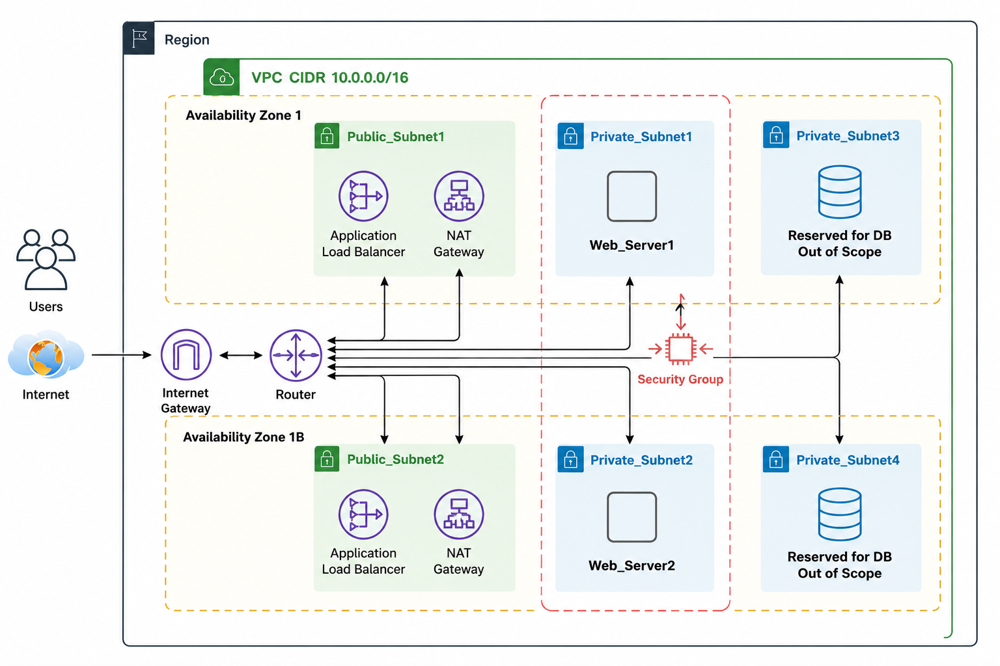

# Aws-Three-Tier-Terraform

Terraform configuration that provisions a modular, three-tier web architecture on AWS: a public-facing Application Load Balancer, an Auto Scaling web tier running in private subnets, and NAT-routed internet egress — with networking, security, IAM, load balancing, and compute split into independent, reusable modules.

## Architecture



- VPC CIDR: `10.0.0.0/16`, split across 2 Availability Zones for high availability.
- Instances launch only in the private subnets and are never directly internet-facing.
- Each public subnet has its own NAT Gateway so each private subnet's outbound traffic stays within its own Availability Zone.
- The ALB spans both public subnets and forwards HTTP traffic to the web tier's target group.
- EC2 instances get SSM (Session Manager) access via an instance profile, so no SSH key/bastion host is required.
- **Reserved for future work**: a data-tier private subnet per AZ (`Private_Subnet3`/`4` in the diagram) for a database layer (e.g. RDS Multi-AZ). Not created by this configuration yet — the `vpc` module currently provisions only the 2 public + 2 private (web tier) subnets shown above.

## Project structure

```
With Variables/
├── main.tf              # Provider + module wiring (root module)
├── variables.tf          # Root input variable declarations
├── terraform.tfvars      # Root input variable values
├── output.tf             # Root outputs
└── modules/
    ├── vpc/               # VPC, subnets, route tables, IGW, NAT gateways
    ├── security_groups/   # Web tier + ALB security groups
    ├── iam/               # EC2 SSM role, policy, instance profile
    ├── alb/               # Target group, Application Load Balancer, listener
    └── asg/               # AMI lookup, launch template, Auto Scaling group
```

Each module is self-contained (`main.tf` + `variables.tf` + `outputs.tf`) and only takes the inputs it needs, so any module can be reused independently in another project.

## Modules

| Module | Creates | Key inputs | Key outputs |
|---|---|---|---|
| `vpc` | VPC, IGW, 2 public + 2 private subnets, public/private route tables and associations, 2 EIPs, 2 NAT gateways | `vpc_cidr_block`, subnet CIDRs/AZs | `vpc_id`, `public_subnet_ids`, `private_subnet_ids` |
| `security_groups` | `web_sg` (HTTP from anywhere), `alb_sg` (HTTP from anywhere) | `vpc_id` | `web_sg_id`, `alb_sg_id` |
| `iam` | IAM role + trust policy, inline SSM permissions policy, instance profile | `role_name` | `instance_profile_name` |
| `alb` | Target group, Application Load Balancer, HTTP listener | `vpc_id`, `public_subnet_ids`, `alb_sg_id`, `dereg_delay` | `alb_dns_name`, `target_group_arn` |
| `asg` | Latest Amazon Linux 2 AMI lookup, launch template (with `script.sh` bootstrap via `user_data`), Auto Scaling group | `instance_type`, `instance_profile_name`, `web_sg_id`, `private_subnet_ids`, `target_group_arn`, `desired_capacity`, `max_size`, `min_size` | `asg_name` |

## Root variables

| Variable | Description | Default |
|---|---|---|
| `region` | AWS region | `us-east-1` |
| `profile` | AWS CLI profile | `default` |
| `vpc_cidr_block` | CIDR block for the VPC | `10.0.0.0/16` |
| `public_subnet1_cidr_block` / `public_subnet2_cidr_block` | CIDR blocks for the public subnets | *(required, no default)* |
| `private_subnet1_cidr_block` / `private_subnet2_cidr_block` | CIDR blocks for the private subnets | *(required, no default)* |
| `public_subnet1_az` / `public_subnet2_az` | AZs for the public subnets | `us-east-1a` / `us-east-1b` |
| `private_subnet1_az` / `private_subnet2_az` | AZs for the private subnets | `us-east-1a` / `us-east-1b` |
| `instance_type` | EC2 instance type for the launch template | `t2.micro` |
| `desired_capacity` | Desired instance count in the ASG | `2` |
| `max_size` | Maximum instance count in the ASG | `4` |
| `min_size` | Minimum instance count in the ASG | `1` |
| `instance_profile_role_name` | Name for the IAM role/instance profile | `EC2_SSM` |
| `dereg-delay` | ALB target group deregistration delay (seconds) | `10` |

Values actually used for this deployment are set in [`terraform.tfvars`](terraform.tfvars); adjust them there rather than editing defaults in `variables.tf`.

## Usage

```bash
# Initialize providers and modules
terraform init

# Preview the changes Terraform will make
terraform plan

# Apply the configuration
terraform apply

# Tear everything down when done
terraform destroy
```

AWS credentials must be available via the profile configured in `terraform.tfvars` (or the default provider credential chain).

## Outputs

| Output | Description |
|---|---|
| `alb_dns` | Public DNS name of the Application Load Balancer — use this to reach the web tier |

## Notes

- The target group's deregistration delay is lowered to 10 seconds (default is 300s) purely to make `terraform destroy` faster in this learning/test environment. Raise it for anything closer to production.
- EC2 access is via AWS Systems Manager Session Manager (no SSH key pair or bastion required) — connect with `aws ssm start-session --target <instance-id>`.
- The web tier bootstrap script ([`modules/asg/script.sh`](modules/asg/script.sh)) installs and starts Apache (`httpd`) via `user_data`.
